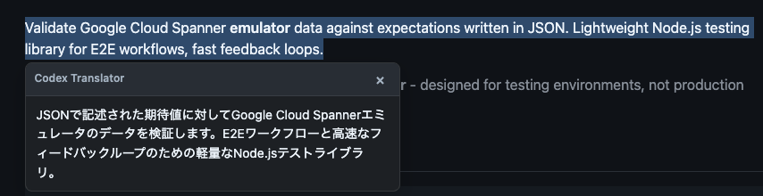

# Codex Translator

Translate selected text on any web page using a local [`codex app-server`](https://developers.openai.com/codex/app-server). No API key needed if you `codex login`-ed; nothing leaves `127.0.0.1`.

## Demo




## Setup

```bash
# 1. Get the extension
#    Download the latest zip from Releases and unzip it:
#    https://github.com/nu0ma/codex-translator-chrome-extension/releases
#    Then in Chrome: chrome://extensions → Developer mode → Load unpacked → select the unzipped folder.

# 2. Run the local server (separate terminal, in this repo)
git clone https://github.com/nu0ma/codex-translator-chrome-extension.git
cd codex-translator-chrome-extension
pnpm install
pnpm serve
```

That's it — select text on any page → click **Translate**.

> `pnpm serve` spawns `codex app-server` on `:4501` and runs a tiny Node proxy on `:4500` that strips Chrome's `Origin` header (which codex-app-server otherwise rejects).

## Settings

Extension icon → settings:

| Field           | Default                   |
| --------------- | ------------------------- |
| WebSocket URL   | `ws://127.0.0.1:4500`     |
| Model           | _(empty = codex default)_ |
| Target language | `Japanese`                |
| Timeout         | `60000` ms                |

## Develop

```bash
pnpm dev       # esbuild watch
pnpm verify    # typecheck + lint + test + build
pnpm package   # zip dist/
```

## License

MIT
